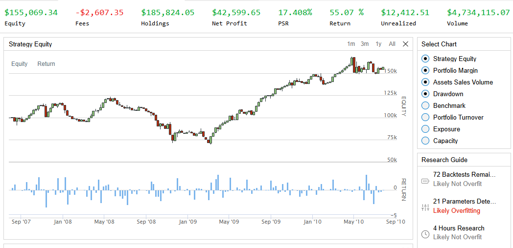
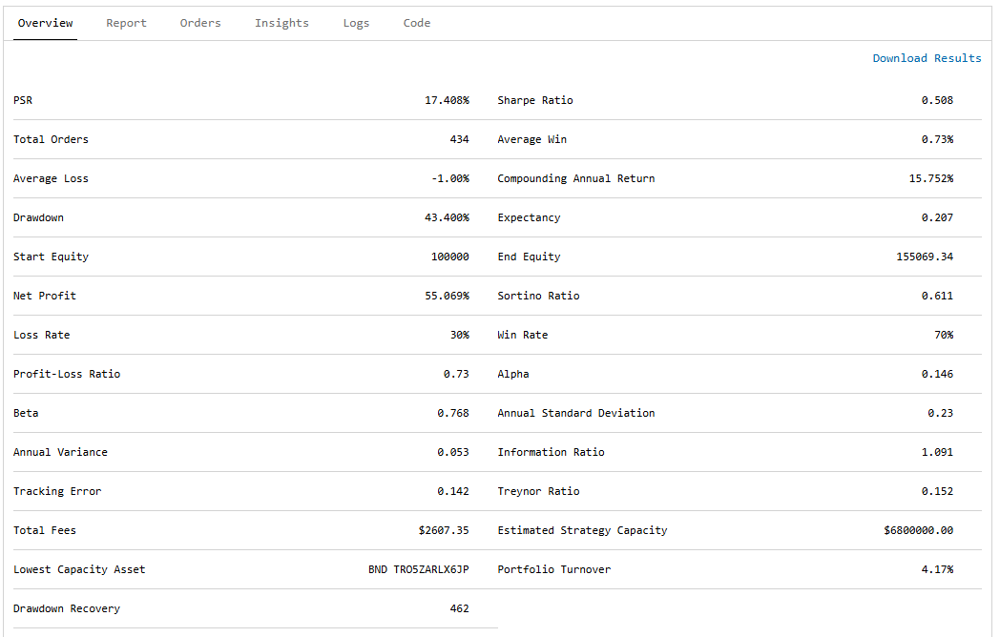
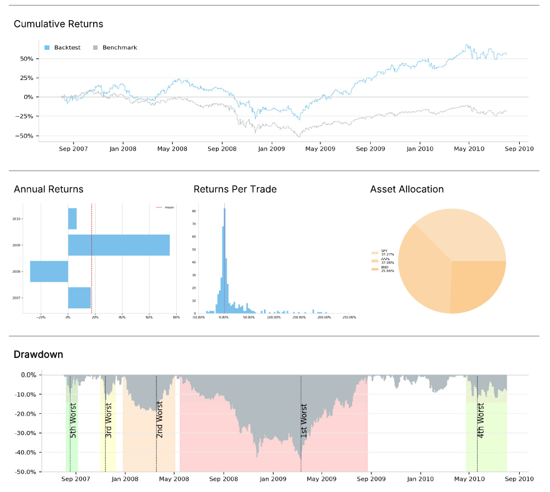
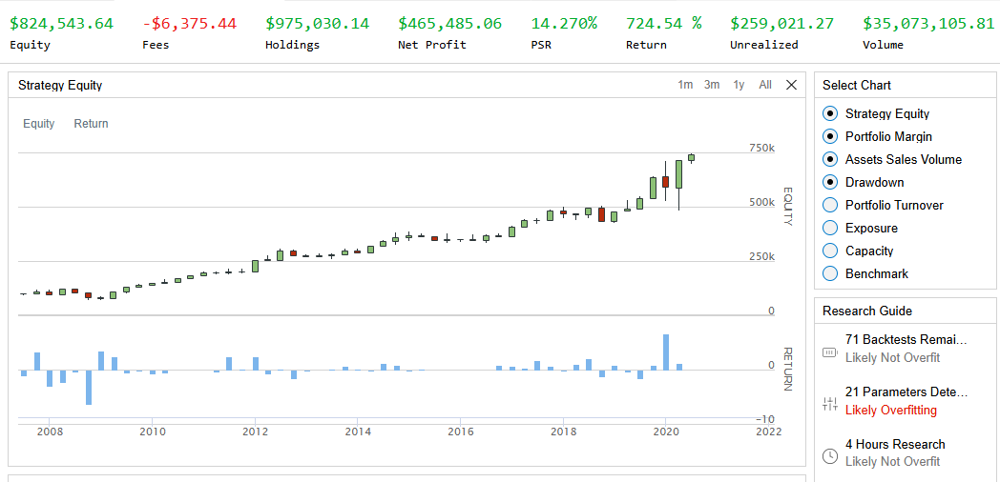
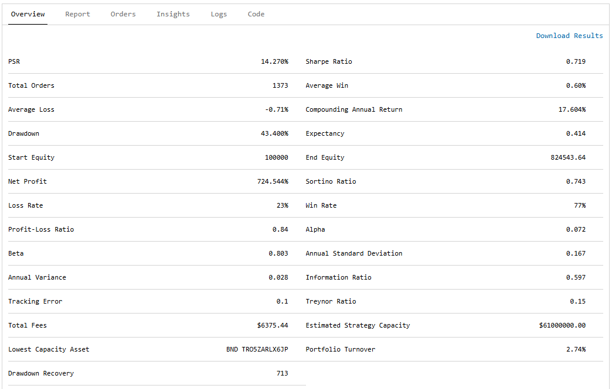
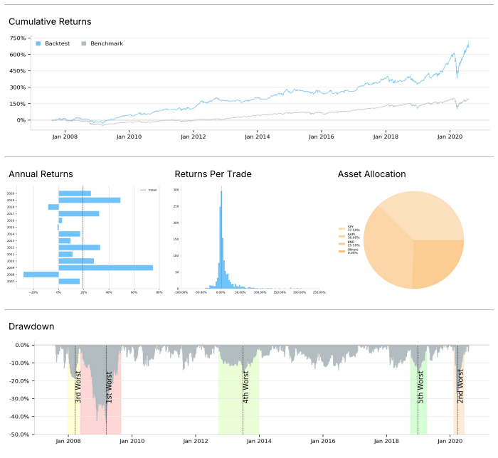
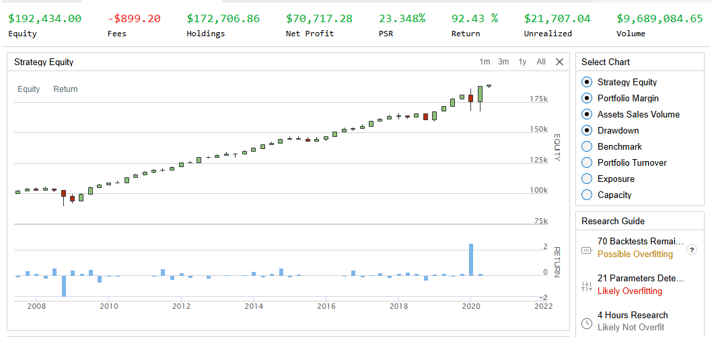
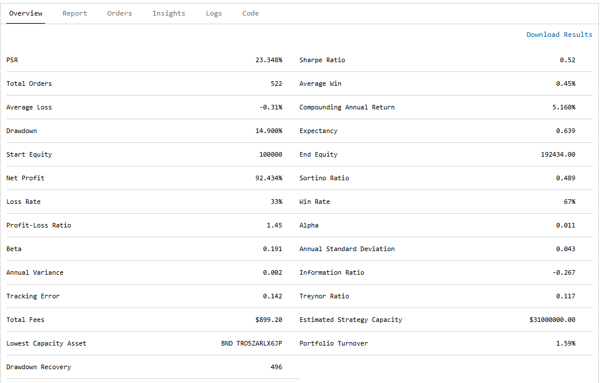
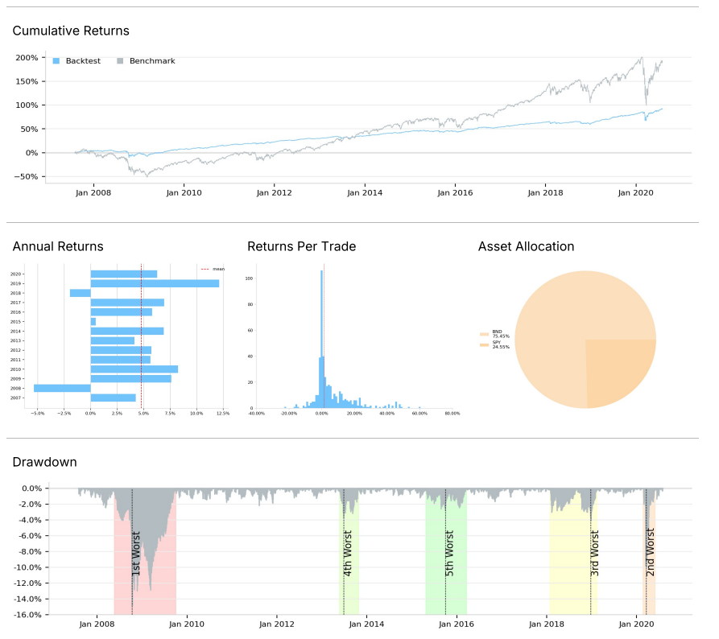

# Momentum-Based Trading Algorithm
Software Meets Wall Street: Cloud-Powered Trading Algorithms (OpenAvenues Built Project for June 2025)

## Description
This is an exercise to create a trading algorithm. A momentum-based trading algorithm is implemented on QuantConnect.com.

## Trading Thesis
We will allocate our funds among the the following assets: SPY (SPDR S&P 500 ETF Trust), BND (Vanguard Total Bond Market Index Fund), and the stock for a single volatile publicly-traded company (whose symbol is to be loaded from an external file). Momentum of their prices will be used to determine how to reallocated the assets. We have three different allocation alternatives. 
* Neutral (30% SPY, 30% BND, 40% cash)
* Stock focused (50% SPY, 20% BND, 50% stock)
* Bond focused (20% SPY, 70% BND, 20% stock)

Note: The asset allocation proportions in theses three alternatives are parameters that can be adjusted as desired.

To begin, we will allocate the assets into the Neutral allocation. We will use 30-day momentum indicators for all three assets as signals to decide who to reallocate the assets. 
The following is decision rules for reallocation.
* If the indicators are all negative, we are assuming the market is risky, so we will go into Neutral.
* If stock's momentum is higher than SPY, we will be stock focused.
* If Bond's is higher than SPY's momentum, we will be bond focused.
* Otherwise, we will do nothing.  

## Experiment
The stock symbol for the single volatile publicly-traded company will be stored in a text file on GitHub, and the file will be loaded into the QuantConnect program during run time. The purpose for doing this is to practice the technique of accessing external data source from a QuantConnect program. The individual publicly traded company stock used was AAPL.

Several backtests were done. 
* Backtest1 was run from Aug-1-2007 to Aug-1-2010, with AAPL as the stock.
* Backtest2 was run from Aug-1-2007 to Aug-1-2020, with AAPL as the stock.
For analysis of the trading algorithm, SPY was used as the benchmark.

For additional comparison, one more backtest was performed using SPY in place of AAPL as the stock (so SPY was used for both the market basket fund, and as the proxy for one individual publicly traded company).

## Result
### Backtest 1: Aug-1-2007 to Aug-1-2010: Symbol AAPL

### Backtest 2: Aug-1-2007 to Aug-1-2020: Symbol AAPL

### Backtest 3: Aug-1-2007 to Aug-1-2020: Symbol SPY

## Analysis
For both backtests, the charts for Cumulative Returns show that the proposed algorithm outpaced the SPY Benchmark significantly. 
Additionally, we see that: 
* for Backtest1 (with AAPL) over 3 years, the return was 55% with a Sharpe Ratio of 0.508. 
* for Backtest2 (with AAPL) over 13 years, the return was 725% with a Sharpe Ratio of 0.719.

However, we are doing backtesting knowing that AAPL has performed extremely well in the past, so the choice of this stock for experiment might not be too information for the performance of this trading algorithm. Therefore, we compare against Backtest3 where we use SPY in place of AAPL. We see that:
* for Backtest3 (with SPY in place of AAPL) over 13 years, the return was only 92% with a Sharpe Ratio of 0.52.
From this, we see that the choice of the individual company stock is crucial to the return of the algorithm. Since SPY is significantly less volatile as compared with AAPL, so the return for Backtest3 is significantly less than that of Backtest2 over the the same time period.

However, the momentum algorithm seems to provide a buffer against the loss from the 2007 Financial Crisis. This can be see in the Cumulative Returns charts for the 3 backtests, all of which shows that the momentum algorithm performs better than the bench during the 2007 crisis. On the other hand, the algorithm seems to perform less well against the benchmark during the 2020 Covid-19 Pandemic. So perhaps further experimentation and analysis is needed to fine-tune the asset allocation proportion parameters this trading strategy to protect against volatility and to increase potential profits. 

## Conclusion
The proposed momentum trading algorithm seems to be able to provide significant returns, providing that the trader is well capitalized, has a significantly long time horizon, and has choisen a good individual company stock for use with the algorithm. But further investigation may be needed to examine the volatility risks and to fine-tune the parameters such as the asset allocation proportions. 

## QuantConnect PDF Reports
* [Backtest1 AAPL 3 year Period Report](./backtest-report/Report1%20-%20Jumping%20Fluorescent%20Yellow%20Lemur%20-%20dea6c26b6069fa6bf831e7b4921c5855.pdf)
* [Backtest2 AAPL 13 year Period Report](./backtest-report/Report2%20-%20Crawing%20Yellow%20Dog%20-%201bf8a65746d4f7924475b5935c598286.pdf)
* [Backtest3 SPY 13 year PEriod Report](./backtest-report/Report3%20-%20Geeky%20Red%20Orange%20Jaguar%20-%2070f4db255fb5fe08364788ff2e73d395.pdf)

## Note
The algorithm and code for this project is partly inspired by what is taught at QuantConnect's Boot Camp 101.
https://www.quantconnect.com/learning/course/1/Boot-Camp-101-US-Equities

